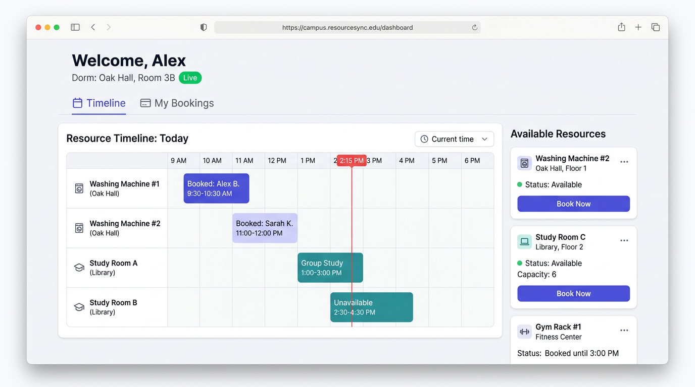
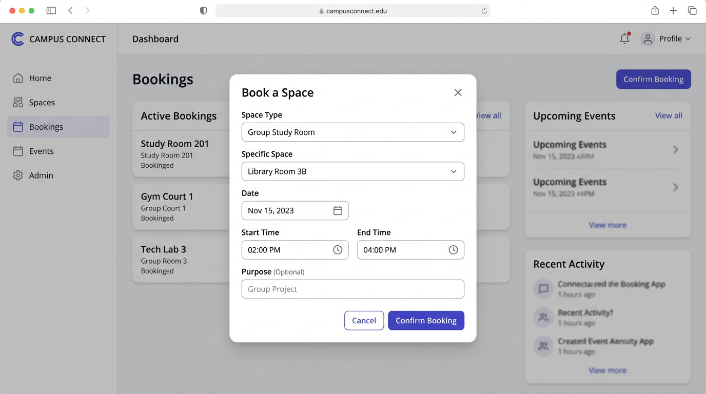

# Campus Resource Sync

A real-time web platform for booking shared university campus resources — laundry, study rooms, meeting rooms, and more — with live updates, conflict-safe scheduling, an AI assistant, and an admin panel.

## Demo

| Timeline | Booking modal |
|----------|--------------|
|  |  |

## Tech stack

| Layer | Technology |
|-------|-----------|
| **Frontend** | React 18, TypeScript, Vite, Zustand, CSS Modules |
| **Backend** | FastAPI, SQLAlchemy 2 (async), Alembic, Pydantic v2 |
| **Database** | PostgreSQL 16 |
| **Auth** | JWT (access + refresh tokens), bcrypt |
| **Real-time** | WebSockets (native FastAPI) |
| **AI assistant** | OpenRouter API (`openai/gpt-4o-mini`), tool-use loop |
| **Telegram bot** | aiogram 3, APScheduler |
| **Infra** | Docker Compose, Nginx reverse proxy |

## Product context

### End users

- **Students** living in university dorms who need shared facilities (washing machines, dryers, study rooms, meeting rooms, rest areas).
- **Teaching Assistants (TAs)** who need extended access to study rooms.
- **Campus administrators** who manage resource availability and monitor all bookings.

### Problem

Students walk to a shared resource — a washing machine, a study room — only to find it already occupied. There is no central place to see what is free, reserve a slot in advance, or get notified when something becomes available. Conflicts and wasted trips are a daily friction point.

### Solution

Campus Resource Sync gives every student a live timeline of all campus resources with a visual booking interface. Reservations are enforced at the database level — double-booking is impossible. The dashboard updates in real time over WebSockets so everyone sees the current state. An AI assistant handles natural-language requests ("book a washer in my dorm tomorrow at 10") on top of the same live data.

## Features

### Implemented

- **Student registration and login** — JWT-based auth with access and refresh tokens; optional TA code grants extended booking privileges.
- **Resource timeline** — scrollable 24-hour grid grouped by floor, showing all bookings for the selected dorm and date.
- **Booking modal** — time-slot picker, duration selector (students: 1–3 h, TAs/admins: 1–8 h), instant confirmation.
- **My Bookings tab** — list of upcoming confirmed reservations with one-click cancel.
- **Real-time updates** — WebSocket connection keeps the timeline and booking counter current for all connected users.
- **AI assistant** — floating chat panel powered by OpenRouter; understands natural-language requests, books or cancels resources, knows the user's dorm, and refreshes the timeline automatically after every action.
- **Admin panel** — separate login, resource management (toggle available ↔ maintenance), full bookings table with per-row cancel.
- **Maintenance overlay** — resources in maintenance state show a red hatched overlay on the timeline and cannot be booked.
- **Dark / light theme** toggle, persisted per browser.
- **Telegram bot** — scheduled reminders and booking management via chat (`bot/`).
- **Full Docker Compose stack** — PostgreSQL, Alembic migrations, FastAPI backend, React frontend, Nginx reverse proxy, Telegram bot, all wired together.

### Not yet implemented

- **HTTPS / TLS** — the default stack serves HTTP on port 80; a reverse proxy (Caddy, Certbot + Nginx) can be added in front.
- **Email notifications** — no email reminders in the current stack.
- **Resource creation via UI** — admins can toggle status and manage bookings; adding new resource records requires a migration or direct DB insert.
- **Mobile-native app** — the web app is responsive but there is no dedicated iOS/Android client.

## Usage

1. Open `http://<server-ip>` in a browser.
2. **Register** as a student — fill in your name, dorm number, room, and password. If you have a TA code, enter it to unlock extended booking durations.
3. On the **Timeline** tab, select a date and dorm, click any free cell to open the booking modal, pick a time slot and duration, and confirm.
4. Switch to **My Bookings** to view upcoming reservations and cancel them if needed.
5. Use the **AI assistant** button (bottom-right) to book or check availability using natural language — for example:
   - *"Book a washing machine in my dorm tomorrow at 9"*
   - *"Find me 3 random study rooms for tomorrow at 14:00"*
   - *"Cancel my booking for tomorrow"*
6. **Admins** navigate to `/admin/login`, sign in with the admin credentials, and use the admin panel to toggle resource status or cancel any booking.

API documentation (Swagger UI) is available at `http://<server-ip>/api/docs`.

## Deployment

**Target OS:** Ubuntu 24.04 LTS

### What must be installed on the VM

| Tool | Purpose |
|------|---------|
| **Git** | Clone the repository |
| **Docker Engine** + **Compose plugin** | Run the containerised stack |

Port **80** must be open in the VM's firewall (and **443** if you add HTTPS later).

### Step-by-step

**1. System update and Git**

```bash
sudo apt update && sudo apt upgrade -y
sudo apt install -y git
```

**2. Install Docker**

```bash
curl -fsSL https://get.docker.com -o get-docker.sh
sudo sh get-docker.sh
sudo usermod -aG docker "$USER"
newgrp docker   # apply group without logging out
```

**3. Open firewall**

```bash
sudo ufw allow OpenSSH
sudo ufw allow 80/tcp
sudo ufw enable
```

**4. Clone the repository**

```bash
git clone https://github.com/darklllidan/se-toolkit-hackathon-.git
cd se-toolkit-hackathon-
```

**5. Configure environment**

```bash
cp .env.example .env
nano .env
```

Required values to fill in:

| Variable | Description |
|----------|-------------|
| `POSTGRES_PASSWORD` | Strong database password |
| `SECRET_KEY` | Random 32-byte hex — `openssl rand -hex 32` |
| `BOT_INTERNAL_SECRET` | Random 32-byte hex — `openssl rand -hex 32` |
| `OPENROUTER_API_KEY` | API key from [openrouter.ai](https://openrouter.ai) (required for AI assistant) |
| `FRONTEND_URL` | Public origin as seen by the browser, e.g. `http://YOUR_VM_IP` |
| `BOT_TOKEN` | Telegram bot token from @BotFather (optional — leave blank to disable) |
| `ADMIN_PASSWORD` | Password for the seeded admin account (default: `admin123`) |

> **Never commit `.env` to Git.**

**6. Build and start**

```bash
docker compose up -d --build
```

Wait for the `migrate` service to finish, then check all services are up:

```bash
docker compose ps
```

**7. Verify**

```bash
curl -I http://localhost        # should return 200
curl http://localhost/api/docs  # should return Swagger HTML
```

Open `http://YOUR_VM_IP` in a browser — the app should load.

**8. Updating after code changes**

```bash
git pull
docker compose up -d --build
```

---

### Notes

- `docker-compose.override.yml` adds hot-reload and exposed ports for **local development**. On a production VM, either delete it or do not copy it — `docker compose` will then use only `docker-compose.yml`.
- Default admin credentials: username `Admin`, password as set in `ADMIN_PASSWORD` (default `admin123`). Change this before going public.
- The Telegram bot starts automatically if `BOT_TOKEN` is set in `.env`. Leave it empty to keep the service from connecting.
